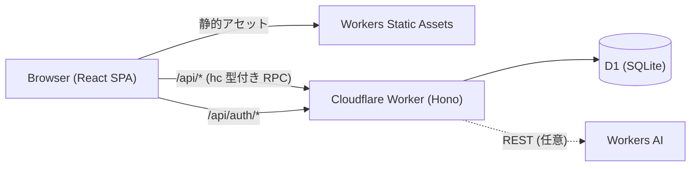

# cloudflare-templete

AI駆動開発を前提にした Cloudflare Workers + D1 + React + Hono のテンプレート。サンプル実装 `notes`（ノート投稿 + AI要約 + 所有権）が全層を1本で貫通しており、「`notes` と同じパターンで自分のエンティティを足す」だけで新しいプロダクトを作れます。

## 構成

| レイヤ | 技術 | 特徴 |
|---|---|---|
| フロント | React 19 + Vite 7 + TypeScript + Tailwind v4 + shadcn/ui | SPA、ポーリングによる簡易リアルタイム |
| サーバー | Hono + Zod on Cloudflare Workers | routes/services/db/lib の4層分離 |
| DB | Cloudflare D1 (SQLite) | 連番マイグレーション運用 |
| 契約 | `src/shared/schemas.ts`（Zod 単一真実源） | `hc<AppType>` で codegen なしの型付き RPC |
| 認証 | Better Auth | 共有契約の外側に隔離、匿名フローと共存 |
| AI | Workers AI（REST + 決定的スタブ縮退） | クレデンシャル無しでも全機能が動く |
| テスト | Vitest（実D1 workersプール + jsdom/MSW）+ Playwright | 3層テスト、スキーマ駆動モック |
| AIハーネス | CLAUDE.md + path-scoped rules + hooks + レビュアーagent | 決定論ガード・自動検証ループ・並行レビュー |



## ディレクトリ

```text
src/
├── client/        # React SPA（pages / components / hooks / api / lib / utils）
├── server/
│   ├── routes/    # Hono handler + zValidator。例外 → ApiErrorCode JSON への変換はここだけ
│   ├── services/  # ビジネスロジック。型付きエラーを投げる
│   ├── db/        # D1 prepared statements。snake_case ↔ camelCase 変換はここだけ
│   ├── lib/       # errors（エラーボディ）/ summarizer（AIシーム）
│   ├── auth.ts    # Better Auth（リクエストごとに生成）
│   └── index.ts   # ルート合成・AppType 捕捉・SPA フォールバック
├── shared/        # Zod スキーマ（契約の単一真実源）・定数・UI 文言
migrations/        # D1 連番マイグレーション
tests/
├── unit/          # スキーマ・サマライザ等（workers プール）
├── integration/   # app.fetch 直叩き + 実 miniflare D1（MSW 禁止）
├── client/        # jsdom + MSW（tests/mocks が唯一のモック源）
└── e2e/           # Playwright（実 dev サーバー、Page Object + data-testid）
```

## セットアップ

```bash
npm install
npm run db:migrate:local
```

## ローカル開発

```bash
npm run dev   # → http://localhost:5173
```

`@cloudflare/vite-plugin` により、**単一プロセス**でフロント（HMR）+ workerd ランタイム + D1 バインディングがすべて動きます。別 API サーバーは不要です。

そのままでも全機能が動きます（AI 要約は決定的スタブ）。実 Workers AI と明示的な auth シークレットを使う場合:

```bash
cp .dev.vars.example .dev.vars   # 値を実物に置き換える
```

## テスト

| コマンド | 内容 |
|---|---|
| `npm run typecheck` | `wrangler types` 生成 + 4 tsconfig の tsc |
| `npm run test` | unit + integration（実 miniflare D1）+ client（jsdom + MSW） |
| `npm run test:coverage` | 上記 + カバレッジ（`coverage/`） |
| `npm run test:e2e` | Playwright E2E（dev サーバー自動起動） |
| `npm run test:e2e:evidence` | E2E + 動画/トレース/ステップスクショ常時記録 |
| `npm run test:e2e:report` | 直近の E2E HTML レポートを開く |

## デプロイ

1. `npx wrangler login`
2. `npm run db:create:remote` を実行し、出力された `database_id` を `wrangler.jsonc` に貼る
3. GitHub リポジトリの Secrets に `CLOUDFLARE_API_TOKEN` / `CLOUDFLARE_ACCOUNT_ID` を設定（E2E で実 AI 要約を使うなら `CLOUDFLARE_AI_TOKEN` も）
4. 本番シークレットを設定:

   ```bash
   npx wrangler secret put BETTER_AUTH_SECRET   # openssl rand -base64 32
   npx wrangler secret put BETTER_AUTH_URL      # 例 https://<app>.<account>.workers.dev
   ```

5. main への push で `deploy.yml` が migrate + deploy を実行（GitHub の Settings → Environments で `production` を作成しておく）

## API 仕様

| メソッド | パス | 認可 | 説明 |
|---|---|---|---|
| POST | `/api/notes` | 不要（ログイン中ならオーナー刻印） | ノート作成 |
| GET | `/api/notes` | 不要 | 一覧（新しい順、`isOwner` 付き） |
| GET | `/api/notes/mine` | 必要（401） | 自分のノート一覧 |
| GET | `/api/notes/:id` | 不要 | 単体取得 |
| POST | `/api/notes/:id/summarize` | 不要 | AI 要約を生成して保存 |
| DELETE | `/api/notes/:id` | 必要（401）+ オーナーのみ（403） | 削除。匿名ノートは誰も削除不可 |

エラーは常に `{ "error": "<ApiErrorCode>" }` 形式（`src/shared/schemas.ts` の `apiErrorCodeEnum`）。

## AI駆動開発ガイド（このテンプレートの使い方）

### 新機能の足し方

新機能は **`notes` 縦貫スライスを手本に**、次の順で足します:

1. `src/shared/schemas.ts` にリクエスト/レスポンス/エンティティのスキーマを追加
2. `migrations/00NN_*.sql` を追加（連番、`npm run db:migrate:local`）
3. `src/server/db/` → `services/` → `routes/` の順に実装し、`index.ts` のチェーンに繋ぐ
4. `tests/unit` / `tests/integration` を追加
5. `src/client` の pages/components を追加（`tests/mocks` のハンドラも同時に）

AI への指示例:

> `notes` と同じパターンで `tasks`（title, done フラグ付き）のCRUDを追加して。schemas.ts への追加から統合テストまで。

### `.claude/` ハーネス

- **path-scoped rules**: `.claude/rules/*.md` はフロントマターの `paths:` にマッチするファイルを触ったときだけロードされる。CLAUDE.md には常時関連の事実だけを置く
- **決定論ガード**: `settings.json` の `permissions.deny` + PreToolUse hook `guard.sh` の二重化で、本番デプロイ・リモート migration・force-push を機械的にブロック
- **検証ループ**: Stop hook `verify-stop.sh` がターン終了ごとに `check → typecheck → test` を実行し、赤なら修正を続けさせる
- **並行レビュー**: 実装の節目（モジュール完成・コミット前・PR 前）に `parallel-reviewer` サブエージェントを起動し、Critical/Warning/Suggestion/意図とのズレの構造でレビューを受け、`.claude/reviews/` に保存する

### `notes` を本番プロダクトで消す場合

- `src/shared/schemas.ts` の note 系スキーマ群（`noteSchema`、`*NoteResponseSchema`、`createNoteBodySchema`、`noteIdParamSchema`）
- `src/server/routes/notes.ts` / `services/noteService.ts` / `db/queries.ts` の note 関数
- migrations は**削除せず**、新しい migration で `DROP TABLE notes` を追加する
- `tests/unit` / `tests/integration` / `tests/client` / `tests/e2e` の note 関連テストと `tests/mocks` のハンドラ
- `src/client` の pages/components（HomePage の NoteForm/NoteList、MyNotesPage 等）

## 拡張アイデア

- **リアルタイム化**: ポーリングを Durable Objects + WebSocket に置き換える
- **レート制限**: Workers KV / Durable Objects で IP・ユーザー単位のレート制限
- **ページネーション**: `NOTES_PAGE_LIMIT` の全件取得をカーソル方式に拡張
- **画像添付**: R2 バインディングで画像アップロード + 署名付き URL 配信
- **要約の多言語化**: `summarizer.ts` のプロンプトを差し替え（忠実性制約は維持する）
