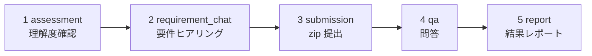
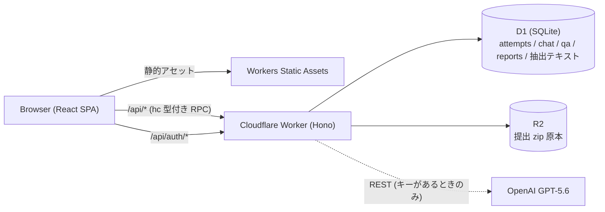

# trAInermAIker

AI がトレーナー役を務める学習支援アプリ。ユーザーは実務形式の課題（例: AWS CDK によるアーキテクチャ設計）に取り組み、AI が「理解度確認 → 要件ヒアリング → 成果物 zip 提出 → 問答 → 結果レポート」の 5 フェーズで学習を伴走します。

要件をそのまま渡さない「意地悪な顧客ペルソナ」との対話で要件を引き出させ、提出物と問答の内容を踏まえた個別フィードバックレポートを返すのが特徴です。



## 構成

| レイヤ | 技術 | 特徴 |
|---|---|---|
| フロント | React 19 + Vite 7 + TypeScript + Tailwind v4 + shadcn/ui | SPA、フェーズごとの UI（react-markdown + シンタックスハイライト） |
| サーバー | Hono + Zod on Cloudflare Workers | routes/services/db/lib の 4 層分離 + content モジュール |
| DB | Cloudflare D1 (SQLite) | 連番マイグレーション運用（現在 0001〜0007） |
| ストレージ | Cloudflare R2 | 提出 zip の原本を保存（抽出テキストは D1） |
| 契約 | `src/shared/schemas.ts`（Zod 単一真実源） | `hc<AppType>` で codegen なしの型付き RPC |
| 認証 | Better Auth | 共有契約の外側に隔離。attempts 系 API はすべて要ログイン |
| AI | OpenAI GPT-5.6（REST + 決定的スタブ縮退） | API キーなしでも全フローが動く |
| テスト | Vitest（実 D1/R2 workers プール + jsdom/MSW）+ Playwright | unit/integration はスタブ、E2E は実 GPT-5.6 |
| AI ハーネス | CLAUDE.md + path-scoped rules + hooks + レビュアー agent | 決定論ガード・自動検証ループ・並行レビュー |



## アーキテクチャ

### サーバー 4 層 + content

- **`routes/`**（`challenges.ts` / `attempts.ts`）: Hono handler + `zValidator`。例外 → `ApiErrorCode` JSON への変換はここだけ。全ハンドラは `c.json(responseSchema.parse(value), status)` で終わる（実行時契約ガード + `hc` の型源）
- **`services/`**: ビジネスロジック。`AttemptNotFoundError` / `InvalidPhaseError` などの型付きエラーを投げる
- **`db/`**: D1 prepared statements。snake_case 行 → camelCase ドメインオブジェクトの変換はここだけ
- **`lib/`**: `ai.ts` / `agent.ts` / `prompts.ts` / `stubs.ts` / `zip.ts` / `errors.ts`
- **`content/`**: 課題コンテンツ（下記）

### 共有 Zod 契約

`src/shared/schemas.ts` が契約の単一真実源。ドリフトするとサーバー `AppType` 推論・クライアント `safeParse` ガード（2xx 不一致で `INVALID_RESPONSE`）・`tests/mocks/` のファクトリ/ハンドラの 3 層が同時に壊れる設計です。

### 課題コンテンツのコード管理と公開/秘匿分離

課題は D1 ではなく **コード**（`src/server/content/`）で管理します。`ChallengeContent` は公開フィールド（`id` / `title` / `category` / `summary` / `descriptionMd` / `submissionGuideMd`）と秘匿フィールド（`hiddenSpecMd` / `rubricMd` / `personaBrief` / `learningPoints`）を分離しており、**秘匿フィールドは AI プロンプト専用で wire に一切出ません**（`challengeDetailSchema` に対応スキーマが意図的に存在しない）。詳細要件はユーザーが要件ヒアリングチャットで引き出す前提です。

### AI シーム（`src/server/lib/ai.ts` + `agent.ts`）

依存解決は `AI_STUB=1` → 強制スタブ / `OPENAI_API_KEY` あり → OpenAI Chat Completions REST（既定モデル `gpt-5.6`、会話系 30 秒・heavy 300 秒）/ キーなし → 決定的スタブ、の順。対話系ロール（理解度評価・要件チャット・レポート問答）は AI 起因で throw せずスタブに縮退します。重いロール（QA 生成・レポート）は Cloudflare Workflows で非同期実行し、失敗はリトライのうえ `generation_status=failed`（stub を成功結果として永続化しない）。`AI_STUB`/キーなし時のみ決定的スタブを即時 insert。要件チャットには秘匿仕様の逐語リーク検知ガード（`guardVerbatimLeak`）付き。

### zip パイプライン（`src/server/lib/zip.ts` + `submissionService.ts`）

fflate の `unzipSync` + central directory 段階でのフィルタで、zip 爆弾（エントリ数・非圧縮合計超過）を展開前に拒否。パストラバーサル正規化、`node_modules`/`.git`/`cdk.out` 等の除外、バイナリ判定、ファイル数・文字数キャップを通過したテキストのみを抽出します。**原本 zip は R2**（`SUBMISSIONS` バインディング）、**抽出テキストは D1** に保存し、AI プロンプトには README → `bin/` → `lib/` → その他の順で最大 10 万文字まで埋め込みます。再アップロードは旧原本・旧抽出行を破棄して置換。

### フェーズ状態機械（`src/server/services/attemptService.ts`）

attempt は `assessment → requirement_chat → submission → qa → report` の一方向に進みます。遷移は `updateAttemptPhase` の **CAS（現フェーズ一致時のみ UPDATE）** で直列化され、二重リクエストの敗者は `INVALID_PHASE`(409)。前進ガードは各フェーズの未達を `CHAT_REQUIRED` / `SUBMISSION_REQUIRED` / `QA_INCOMPLETE` で返します。CAS 通過後・生成物 INSERT 前にクラッシュしても、`getQaState` / `getReport` が **self-heal**（不足している QA 質問/レポートをその場で生成）するため詰みません。assessment 完了時に保存される `skillProfile` は以降の全 AI フェーズが参照します。

## ディレクトリ

```text
src/
├── client/            # React SPA
│   ├── pages/         # ChallengeList / ChallengeDetail / AttemptWorkspace / Signup / Login / NotFound
│   ├── components/    # PhaseStepper / ChatPanel / ReportView / SubmissionUploader / phases/（5フェーズUI）/ ui/
│   ├── hooks/         # useAttempt / useChatThread / useTextSelection
│   ├── api/           # hc クライアント + safeParse ガード
│   └── lib/           # authClient / highlight / utils
├── server/
│   ├── routes/        # challenges / attempts（例外 → ApiErrorCode JSON はここだけ）
│   ├── services/      # attempt / assessment / chat / submission / qa / report / challenge
│   ├── db/            # D1 prepared statements（snake_case ↔ camelCase 変換はここだけ）
│   ├── content/       # 課題コンテンツ（コード管理、公開/秘匿分離）
│   ├── lib/           # ai / agent / prompts / stubs / zip / errors
│   ├── auth.ts        # Better Auth（リクエストごとに生成）
│   └── index.ts       # ルート合成・AppType 捕捉・SPA フォールバック
├── shared/            # Zod スキーマ（契約の単一真実源）・定数・UI 文言
migrations/            # D1 連番マイグレーション（0001〜0007）
tests/
├── unit/              # zip / agent / スキーマ / content 等（workers プール）
├── integration/       # app.fetch 直叩き + 実 miniflare D1/R2（MSW 禁止）
├── client/            # jsdom + MSW
├── mocks/             # スキーマ駆動のファクトリ/ハンドラ（jsdom テスト唯一のモック源）
├── fixtures/          # cdkZip（提出 zip フィクスチャ）
├── helpers/           # renderWithProviders
└── e2e/               # Playwright（実 dev サーバー・実 GPT-5.6）
```

## セットアップ

```bash
npm install
npm run db:migrate:local
npm run dev   # → http://localhost:5173
```

`@cloudflare/vite-plugin` により、**単一プロセス**でフロント（HMR）+ workerd ランタイム + D1/R2 バインディングがすべて動きます。別 API サーバーは不要です。

そのままでも全フローが動きます（AI は決定的スタブ）。実 GPT-5.6 を使う場合:

```bash
cp .dev.vars.example .dev.vars   # OPENAI_API_KEY を設定（BETTER_AUTH_* も必要に応じて）
```

## テスト

| コマンド | 内容 |
|---|---|
| `npm run test` | unit + integration（実 miniflare D1/R2）+ client（jsdom + MSW） |
| `npm run test:watch` | Vitest watch モード |
| `npm run test:coverage` | 上記 + カバレッジ（`coverage/`） |
| `npm run test:e2e` | Playwright E2E（dev サーバー自動起動） |
| `npm run test:e2e:evidence` | E2E + 動画/トレース/ステップスクショ常時記録 |
| `npm run test:e2e:report` | 直近の E2E HTML レポートを開く |

**方針: unit / integration はスタブ、E2E は実 GPT-5.6。**

- unit / integration は workers プールの設定（`vitest.workers.config.ts`）で `AI_STUB=1` が固定されており、**決定的・オフライン**で動きます。`.dev.vars` に実キーがあってもスタブが勝ちます
- E2E は実 GPT-5.6 に対して実行します。ローカルは `.dev.vars` の `OPENAI_API_KEY`、CI は GitHub Secret `OPENAI_API_KEY` を使用。キーがない環境（fork PR など）ではアプリ自身のスタブ fallback により自然にスタブ動作となり、suite はそのまま green になります
- **注意**: 実 AI E2E は課題フロー 1 回で **10〜20 回のモデル呼び出し**（QA/レポート生成は 60〜90 秒かかるものあり）が発生し、**1 回 5〜15 分**を見込んでください

単発実行: `npx vitest run tests/unit/agent.test.ts`、`npx playwright test tests/e2e/challenge-flow.spec.ts -g "<タイトル>"`。

## API 仕様

エラーは常に `{ "error": "<ApiErrorCode>" }` 形式（`src/shared/schemas.ts` の `apiErrorCodeEnum`）。認証が必要なエンドポイントは未ログイン時に 401 `UNAUTHORIZED` を返します。他ユーザーの attempt は存在自体を隠すため **403 ではなく 404** `ATTEMPT_NOT_FOUND` になります。

| メソッド | パス | 認証 | 主なエラー |
|---|---|---|---|
| GET | `/api/challenges` | 不要 | – |
| GET | `/api/challenges/:id` | 不要 | `INVALID_ID` 400 / `CHALLENGE_NOT_FOUND` 404 |
| POST | `/api/attempts` | 必要 | `INVALID_BODY` 400 / `CHALLENGE_NOT_FOUND` 404（既存 attempt があれば 200 で返す冪等仕様、新規は 201） |
| GET | `/api/attempts/mine` | 必要 | – |
| GET | `/api/attempts/:id` | 必要 | `ATTEMPT_NOT_FOUND` 404 |
| GET | `/api/attempts/:id/assessment` | 必要 | `ATTEMPT_NOT_FOUND` 404 |
| POST | `/api/attempts/:id/assessment` | 必要 | `INVALID_ASSESSMENT` 400 / `INVALID_PHASE` 409 |
| GET | `/api/attempts/:id/chat` | 必要 | `ATTEMPT_NOT_FOUND` 404 |
| POST | `/api/attempts/:id/chat` | 必要 | `INVALID_PHASE` 409 / `CHAT_LIMIT_EXCEEDED` 409 |
| POST | `/api/attempts/:id/advance` | 必要 | `INVALID_PHASE` / `CHAT_REQUIRED` / `SUBMISSION_REQUIRED` / `QA_INCOMPLETE`（すべて 409） |
| POST | `/api/attempts/:id/submission` | 必要 | `INVALID_PHASE` 409 / `INVALID_ZIP` 400 / `ZIP_TOO_LARGE` 413 |
| GET | `/api/attempts/:id/submission` | 必要 | `SUBMISSION_NOT_FOUND` 404 |
| GET | `/api/attempts/:id/submission/file` | 必要 | `SUBMISSION_NOT_FOUND` / `SUBMISSION_FILE_NOT_FOUND` 404 |
| GET | `/api/attempts/:id/qa` | 必要 | `ATTEMPT_NOT_FOUND` 404 |
| POST | `/api/attempts/:id/qa/answers` | 必要 | `INVALID_PHASE` 409 / `QA_INCOMPLETE` 409 / `QA_COMPLETED` 409 |
| GET | `/api/attempts/:id/report` | 必要 | `REPORT_NOT_FOUND` 404（report フェーズ前） |
| GET | `/api/attempts/:id/report/questions` | 必要 | `ATTEMPT_NOT_FOUND` 404 |
| POST | `/api/attempts/:id/report/questions` | 必要 | `INVALID_PHASE` 409 / `CHAT_LIMIT_EXCEEDED` 409 |

このほか `/api/auth/*`（サインアップ・ログイン等）は Better Auth が所有し、共有 Zod/hc 契約の外側にあります。

## デプロイ runbook

1. **GitHub Secrets / Environment を設定する**
   - `CLOUDFLARE_API_TOKEN` — **「Workers R2 Storage: Edit」権限を含める**こと（deploy.yml が R2 バケットを確保するため）
   - `CLOUDFLARE_ACCOUNT_ID`
   - `OPENAI_API_KEY` — CI の実 AI E2E 用
   - GitHub の Settings → Environments で `production` を作成（deploy.yml が参照）
2. **本番 Worker のシークレットを設定する**

   ```bash
   npx wrangler secret put BETTER_AUTH_SECRET   # openssl rand -base64 32
   npx wrangler secret put BETTER_AUTH_URL      # 例 https://<app>.<account>.workers.dev
   npx wrangler secret put OPENAI_API_KEY
   npx wrangler secret list                     # 3 つ入っていることを確認
   ```

3. **（任意）デプロイ後スモークを有効化する** — リポジトリ Variable `PRODUCTION_URL`（例 `https://<app>.<account>.workers.dev`）を設定すると、deploy.yml がデプロイ後に `/` と `/api/challenges` の疎通を検証します
4. **PR → main merge でデプロイ** — PR で `ci.yml`（check / typecheck / build / test + 実 AI E2E）が green になったら main へ merge。`deploy.yml` は check / typecheck / build / vitest を再実行し（Playwright E2E は PR CI のみ）、R2 バケット確保（`r2 bucket info || create`）→ D1 リモート migrate → `wrangler deploy` → スモークの順に進みます。D1 の `database_id` は設定済み（新規環境を作る場合のみ `npm run db:create:remote` を人間が手動実行して差し替え）
5. **ロールバック** — Cloudflare dashboard の Workers → Deployments から前バージョンへ切り替え。マイグレーションは追記のみ（append-only）運用なので、旧コードへ戻しても常に安全です

## 新しい課題の追加方法

1. `src/server/content/challenge2.ts` などに `ChallengeContent`（`src/server/content/types.ts`）を実装する
2. `src/server/content/index.ts` の `challenges` 配列に登録する

**公開/秘匿の分離ルール**:

- 公開（API で返る）: `id` / `title` / `category` / `summary` / `descriptionMd`（開始前に見せる**あえて曖昧な**問題文）/ `submissionGuideMd`（提出形式・技術的制約）/ `assessmentQuestions`
- 秘匿（AI プロンプト専用・**wire に出してはならない**）: `hiddenSpecMd`（完全な要件仕様）/ `rubricMd`（評価ルーブリック）/ `personaBrief`（顧客ペルソナ設定）/ `learningPoints`（狙いの学習観点）
- 秘匿フィールドを `src/shared/schemas.ts` のレスポンススキーマに追加しない（追加しない限り構造的に漏れない設計）
- `id` は attempts が `challenge_id` で参照するため、**公開後に変更・再利用しない**
- コンテンツ修正は通常のデプロイで反映（マイグレーション不要）

## AI 駆動開発ハーネス（`.claude/`）

- **path-scoped rules**: `.claude/rules/*.md` はフロントマターの `paths:` にマッチするファイルを触ったときだけロードされる。CLAUDE.md には常時関連の事実だけを置く
- **決定論ガード**: `settings.json` の `permissions.deny` + PreToolUse hook `guard.sh` の二重化で、本番デプロイ・リモート migration・force-push を（チェーン・環境変数プレフィックス形も含め）機械的にブロック
- **検証ループ**: Stop hook `verify-stop.sh` がターン終了ごとに `check → typecheck → test` を実行し、赤ならログ付きで停止をブロックして修正を続けさせる（build は最も遅く signal の低いステップとして CI に委譲）
- **並行レビュー**: 実装の節目（モジュール完成・コミット前・PR 前）に `parallel-reviewer` サブエージェントを起動し、Critical/Warning/Suggestion/意図とのズレの構造でレビューを受け、`.claude/reviews/` に保存する
